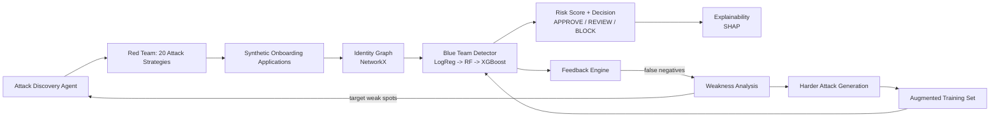
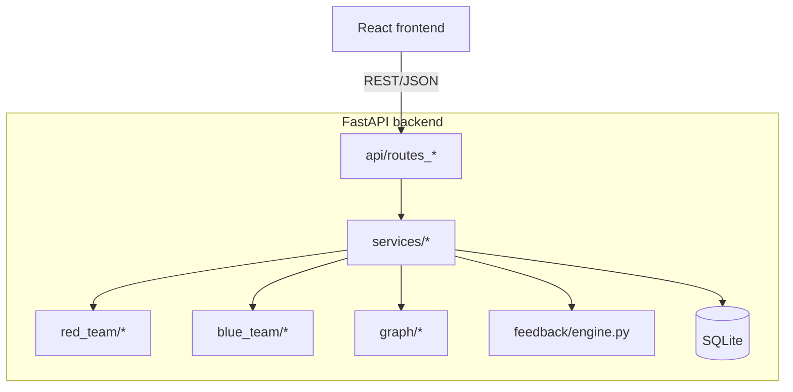

# Identity & Onboarding Fraud Defense Lab

A closed-loop **red team / blue team** system for GenAI-powered **identity and onboarding fraud**, built for the
**Mastercard Innovation Challenge 2026 — AI Defense Lab for Payment Security**.

> Don't just detect known onboarding fraud. Continuously generate new synthetic identity attacks, discover
> weaknesses in the detector, and use those failures to train a stronger detector.

100% free/open-source. No paid APIs, no API keys, no cloud-only services, no real user data or biometrics. Runs
entirely on a laptop.

---

## 1. Problem

Generative AI has made it cheap to fabricate synthetic identities, tamper with documents, spoof liveness checks and
generate AI faces at scale — while static, rule-based KYC/onboarding checks stay fixed. Point-in-time fraud rules
miss coordinated, multi-signal, adaptively-evolving attacks.

## 2. Motivation

Instead of hand-writing detection rules, this project **manufactures its own adversary**: a red-team engine that
generates diverse, realistic identity-fraud attacks, and a blue-team detector that learns from them — including
learning from its own failures, in a closed feedback loop.

## 3. Architecture





### Project structure

```
identity-fraud-defense/
├── backend/
│   ├── main.py, config.py
│   ├── api/            # FastAPI routers (thin -- no ML logic)
│   ├── schemas/         # Pydantic request/response models
│   ├── services/        # service layer: orchestrates red_team/blue_team/graph/feedback + DB
│   ├── models/           # SQLAlchemy ORM (applicants, attacks, predictions, graph, training, feedback)
│   ├── data/             # synthetic data generator + canonical feature schema
│   ├── red_team/         # attack strategy plugins (20 types)
│   ├── blue_team/        # preprocessing, train, predict, evaluate, explain
│   ├── graph/             # identity graph builder + structural features + fraud-ring detection
│   ├── document/          # synthetic document generator + OCR + forensics (real uploads) + field-consistency validator
│   ├── biometric/         # face adapter interface: Synthetic (default) / OpenCV heuristic (real photos) / optional InsightFace
│   ├── discovery/         # attack-discovery agent: optional local LLM (Ollama) + rule-based fallback
│   └── feedback/          # closed-loop engine (evaluate -> find weaknesses -> harden -> retrain)
├── frontend/               # React (Vite) dashboard -- 7 pages, calls the live API only
├── scripts/                # CLI entry points (generate_data, train, evaluate, red/blue team, closed loop)
├── tests/                  # pytest suite (95 tests): attacks, generator, graph, detector, feedback, API, manual onboarding
├── data/, models/          # generated datasets / trained model versions (gitignored)
└── docker-compose.yml, backend/Dockerfile, frontend/Dockerfile
```

## 4. Attack Taxonomy (20 types)

Each is a real `AttackStrategy` subclass (`backend/red_team/*.py`) that mutates a legitimate-looking synthetic
applicant's features according to the attack semantics and a `difficulty ∈ [0,1]` (0 = obvious, 1 = near-legitimate).
New attacks self-register via `@register_attack` -- no giant if/else, no central switch statement.

| Attack Type | What it does |
|---|---|
| `SYNTHETIC_IDENTITY` | Fabricated identity; individually plausible fields, but identity/phone/email/address all "born" close together |
| `IDENTITY_ATTRIBUTE_INCONSISTENCY` | Applicant-submitted fields disagree with the document beyond typo tolerance |
| `DUPLICATE_IDENTITY` | Same document number / name+DOB resubmitted across "different" applications |
| `IDENTITY_REUSE` | Stolen phone+email credential pair reused across identities |
| `DOCUMENT_TAMPERING` | Visual document tampering (splicing, re-compression artifacts) |
| `DOCUMENT_FIELD_MANIPULATION` | Text fields edited on an otherwise-clean document template |
| `FACE_DOCUMENT_MISMATCH` | Real, live selfie -- but not the person on the document |
| `LIVENESS_SPOOF` | Printed photo / screen replay / mask defeats liveness |
| `AI_GENERATED_FACE` | Selfie is a fully AI-generated (non-existent-person) face |
| `DEEPFAKE_LIKE_SELFIE` | Face-swapped/deepfake selfie against a stolen document photo |
| `DEVICE_REUSE` | Many identities share one device |
| `IP_REUSE` | Many identities share one IP |
| `PHONE_REUSE` | Many identities share one phone number |
| `EMAIL_REUSE` | Many identities share one email/inbox pattern |
| `ADDRESS_REUSE` | Many identities share one mail-drop address |
| `RAPID_MULTI_ACCOUNT_CREATION` | Burst of applications in a short time window |
| `FRAUD_RING` | Ring of apparently-unrelated identities sharing infrastructure |
| `COORDINATED_ONBOARDING` | Shared infrastructure + tight, semi-automated cadence |
| `BOT_LIKE_ONBOARDING` | Scripted form-filling telemetry (timing/mouse/corrections) |
| `MULTI_SIGNAL_SYNTHETIC_IDENTITY` | Hardest catch-all: many individually-mild anomalies across signal families |

Full metadata (description, severity, affected features) is served live at `GET /api/attacks`.

## 5. Red Team

`backend/red_team/base.py` defines `AttackStrategy` (strategy pattern): `generate()`, `mutate()`, `description()`,
`severity()`, `features_affected`. `registry.py` is a plugin registry (`@register_attack`) -- adding a new attack
type never touches existing files. Attacks start from a legitimate-looking base population
(`data/generator.py`) and then perturb the relevant features, blending between an "easy" and "hard" target
distribution as `difficulty` increases, with per-row noise so populations always overlap (see §13 in the original
spec / `backend/red_team/utils.py`).

## 6. Attack Discovery Agent

`backend/discovery/attack_discovery.py` tries a local LLM via **Ollama** first (`local_llm.py` -- only used for
*ideation text*, never for the numerical fraud model), and always falls back to a deterministic rule-based engine
(`fallback.py`) if Ollama isn't running. Output is a structured hypothesis:

```json
{
  "attack_type": "MULTI_SIGNAL_SYNTHETIC_IDENTITY",
  "reason": "...",
  "target_weakness": "...",
  "features_to_manipulate": ["email_age_days", "device_reuse_count", "identity_reuse_count"],
  "difficulty": 0.8
}
```

## 7. Blue Team

`backend/blue_team/`: Logistic Regression baseline → Random Forest → **XGBoost** (final model), with
`class_weight="balanced"` / `scale_pos_weight` for the heavy class imbalance, stratified train/val/test splits, and
full metrics beyond accuracy (precision, recall, F1, ROC-AUC, PR-AUC, FPR, FNR, confusion matrix, per-attack-type
recall). Decision thresholds are configurable (`backend/config.py`): `< 0.30` APPROVE, `0.30–0.70` REVIEW, `≥ 0.70`
BLOCK.

## 8. Explainability

`backend/blue_team/explain.py` uses **SHAP** `TreeExplainer` when available, with a dependency-free
feature-importance fallback. Every risk factor is translated to plain language, e.g. *"Device shared with 14 other
identities"*, *"Face/document similarity is low (0.31)"*.

## 9. Identity Graph

`backend/graph/` builds a **NetworkX** graph (no Neo4j) with nodes `{person, phone, email, address, device, ip,
document}` and person→attribute edges. Structural features (reuse counts, connected-component size, graph degree,
a documented `suspicious_cluster_score`) are computed **without touching the fraud label**, so they're safe,
leakage-free ML inputs. `graph/features.py::detect_suspicious_clusters` powers the fraud-ring view.

## 10. Document Pipeline

`backend/document/`: `generator.py` renders a clearly-labeled **"SYNTHETIC IDENTITY DOCUMENT — FOR RESEARCH"**
image (Pillow) with fictional fields and perturbations (blur/noise/rotation/JPEG artifacts); `ocr.py` prefers
PaddleOCR, falls back to Tesseract, falls back to a labeled simulated result if neither is installed; `validator.py`
scores field consistency between OCR output and submitted data.

## 11-12. Biometric / Face Pipeline

**No real faces required, ever.** `backend/biometric/adapter.py` defines `FaceModelAdapter`; the default is always
`SyntheticFeatureAdapter` (`generate_synthetic_face_signal()`), which produces attack-conditional distributions for
`face_similarity_score`, `liveness_score`, `deepfake_probability`, `face_quality_score` (see the profile table in
`biometric/synthetic.py`). An optional `InsightFaceAdapter` (`optional_insightface.py`) is provided for real
embeddings later — install `insightface`/`onnxruntime` and pass `prefer="insightface"` to `get_face_adapter()`; the
rest of the pipeline is unaffected either way.

## 13-14. Realistic, Non-Trivial Data + Adversarial Loop

Distributions are deliberately overlapping (mixed-beta populations, per-row noise) so the dataset is **not**
trivially separable — see `tests/test_detector.py::test_model_metrics_are_not_trivial`. The closed loop
(`backend/feedback/engine.py`):

1. `evaluate_attacks` — score the current dataset with the current model
2. `find_false_negatives` / `analyze_detector_weaknesses` — real, computed weakness report
3. `discover_attack_hypotheses` → `generate_harder_attacks` — new, harder synthetic attacks targeting exactly those weaknesses
4. A **held-out slice** of the new hard batch is scored by the OLD model first (that's what makes it "hard"); only
   the rest is folded into training
5. `retrain_model` — new model version
6. The NEW model is scored on the **same untouched holdout** → genuine before/after comparison (no leakage, no
   hard-coded numbers)

## 15. Reproducible Experiment Pipeline

```bash
python scripts/generate_data.py --n 100000
python scripts/train_model.py
python scripts/evaluate_model.py
python scripts/run_red_team.py --list
python scripts/run_closed_loop.py --n 20000 --iterations 3
```

## 16. Web Application

React (Vite) dashboard, 8 pages, **all data from the live backend**:

1. **Overview** — dataset/model KPIs, closed-loop diagram
2. **Red Team → Attack Generator** — pick type/difficulty/volume, generate, see live distribution charts
3. **Live KYC Form** — the real product path (see §16b below): type your own details, upload/download a document
   photo, capture a live selfie, get scored by the real pipeline
4. **Onboarding Simulator (Auto)** — generate one synthetic applicant (all 6 feature groups), RUN VERIFICATION
5. **Blue Team → Detection Results** — train (3-model comparison), batch detection metrics, single-applicant scoring
6. **Identity Graph** — interactive graph (React Flow) of an applicant's shared attributes + fraud-ring list
7. **Attack Lab** — all 20 attack cards with live generation/detection numbers
8. **Closed Loop** — run N feedback iterations, real before/after recall/precision/F1 chart per iteration

### 16b. Live KYC Form — the real onboarding path

Every other page in this app generates synthetic applicants for bulk training/demo purposes. The **Live KYC Form**
(`frontend/src/pages/LiveOnboarding.jsx`) is different: it is an actual onboarding form, and everything it collects
is real, computed from what you (or a "fraudster" testing the demo) actually submit -- nobody types "this is fraud"
anywhere, the tells show up in what the pipeline computes:

- **Identity fields** — name, DOB, address, phone, email, typed directly.
- **Document photo** — uploaded (or downloaded as a clearly-labeled synthetic sample, clean or pre-tampered, to test
  with if you don't want to use your own ID). Runs through the **real** OCR pipeline
  (`backend/document/ocr.py`, PaddleOCR → Tesseract → labeled fallback) and a dependency-free **image forensics**
  module (`backend/document/forensics.py`: Laplacian-variance blur/sharpness + block-level noise-consistency, pure
  PIL/numpy, no extra install) run on the actual uploaded bytes, then diffed against what you typed
  (`backend/document/validator.py`) for real name/DOB/document-number match scores.
- **Live selfie** — captured via `getUserMedia` in your browser, processed with a real (heuristic, zero-download)
  OpenCV signal: Haar-cascade face detection, sharpness/texture-based liveness proxy, and a coarse histogram-based
  similarity against the document photo (`backend/biometric/opencv_adapter.py`). Honestly documented as a
  demo-grade heuristic, not production face recognition — swap in `optional_insightface.py` for that. Falls back to
  neutral placeholder scores if OpenCV isn't installed or no face is found.
- **Device + IP** — a device fingerprint is computed client-side and persisted in `localStorage`
  (`frontend/src/hooks/useDeviceFingerprint.js`), so repeat submissions from the same browser genuinely register as
  device reuse in the identity graph. IP is read server-side from the request, never typed.
- **Behavior** — typing rhythm, per-field focus transitions, and mouse-movement entropy are captured live from real
  DOM events (`frontend/src/hooks/useTelemetry.js`), not sampled.

The submission (`POST /api/onboarding/submit`, `backend/services/manual_onboarding_service.py`) is folded into the
same live dataset and identity graph as everything else, then immediately scored by the current model — but it is
always tagged `source: "manual"` and **excluded from training and from aggregate Blue Team metrics**
(`backend/blue_team/train.py`, `backend/services/detection_service.py`), because its ground truth is genuinely
unknown; it's still individually scoreable on demand. This is the honest version of "what would a real user have to
enter" — see the README section on Ethics for why nothing here ever needs or stores a real person's biometrics
beyond your own local demo run.

## 17-18. API & Database

FastAPI (`backend/main.py` + `backend/api/routes_*.py`), Pydantic-validated, service-layer separated (no ML/DB code
in route handlers). SQLite by default (`backend/models/db.py`, swap via `IFDL_DB_URL`), tables: `applicants`,
`attacks`, `predictions`, `graph_entities`, `graph_relationships`, `training_runs`, `model_versions`,
`feedback_iterations`.

| Method | Path | Purpose |
|---|---|---|
| GET | `/health` | liveness + model status |
| POST | `/api/generate-applicants` | generate legitimate population |
| POST | `/api/generate-attack` | generate one attack batch |
| POST | `/api/run-red-team` | generate several attack batches |
| POST | `/api/run-blue-team` | train LR/RF/XGBoost, save new model version |
| POST | `/api/score-applicant` | score + explain one applicant |
| POST | `/api/run-detection` | batch-score the current dataset |
| POST | `/api/run-closed-loop` | N feedback iterations |
| GET | `/api/attacks` | attack catalog |
| GET | `/api/attack-results` | per-attack-type generation/detection stats |
| GET | `/api/metrics` | dataset + model metrics |
| GET | `/api/model-info` | current model metadata |
| GET | `/api/graph/{applicant_id}` | shared-attribute graph for one applicant |
| GET | `/api/graph/rings` | suspicious cluster / fraud-ring list |
| GET | `/api/feedback` | closed-loop iteration history |
| POST | `/api/onboarding/simulate` | generate a single **synthetic** demo applicant |
| POST | `/api/onboarding/submit` | **real** Live KYC Form submission (multipart: fields + document image + selfie + telemetry) |
| GET | `/api/document/sample` | download a clearly-labeled synthetic test ID (`?blur=&noise=&rotate=&tamper_fields=`) |

## Installation

**Requirements:** Python 3.11+, Node 18+. No environment variables required to start.

```bash
git clone <this repo> && cd identity-fraud-defense
pip install -r requirements.txt        # backend
cd frontend && npm install && cd ..    # frontend
```

Optional extras — see `requirements-optional.txt`; none are required for the app to run, everything falls back
gracefully without them:

```bash
pip install opencv-python-headless   # real face-detection/liveness heuristic on the Live KYC Form
# tesseract-ocr (system package) or `pip install pytesseract` / `paddleocr`  -- real OCR on uploaded documents
# ollama serve + ollama pull llama3.2                                       -- local LLM attack-discovery ideation
```

## Running

```bash
# Terminal 1
uvicorn backend.main:app --reload --port 8000

# Terminal 2
cd frontend && npm run dev
# open http://localhost:5173
```

Or with Docker: `docker compose up --build` (backend on :8000, frontend on :4173).

Or fully offline via CLI (no server): `python scripts/run_closed_loop.py --n 20000 --iterations 3`.

## Model Metrics

Nothing below is hard-coded — it's copied from an actual `python scripts/train_model.py` run on a generated 9,600-row
dataset spanning all 20 attack types at three difficulty tiers each:

| Model | Precision | Recall | F1 | ROC-AUC | PR-AUC |
|---|---|---|---|---|---|
| Logistic Regression | 0.655 | 0.779 | 0.712 | 0.869 | 0.793 |
| Random Forest | 0.846 | 0.893 | 0.869 | 0.958 | 0.927 |
| **XGBoost (final)** | **0.903** | **0.897** | **0.900** | **0.969** | **0.948** |

A closed-loop run measurably improves recall on held-out **hard** examples the prior model missed, e.g. iteration 2:
`before_recall=0.30 → after_recall=0.68` on the same untouched holdout (see `GET /api/feedback` / Closed Loop page
for your own run's numbers).

## Demo Walkthrough (3-5 min)

1. **Overview** — click "Generate 2,000 legitimate applicants".
2. **Red Team** — generate `FRAUD_RING`, difficulty Hard, 500 applications. Note suspicious clusters / infra reuse
   counts in the response.
3. Generate 3-4 more attack types the same way (or use `POST /api/run-red-team` for one bulk call).
4. **Blue Team** — RUN BLUE TEAM (trains LR/RF/XGBoost, compares them) → RUN DETECTION (batch metrics + per-attack
   recall table).
5. **Live KYC Form** — fill in your own name/DOB/address/phone/email, download the "clean sample ID", upload it back,
   enable your camera and capture a selfie, submit. Then submit again with the *tampered* sample ID and/or a name
   that doesn't match it, and watch the risk score/reasons change based on what the pipeline actually computed.
6. **Onboarding Simulator (Auto)** — generate a `LIVENESS_SPOOF` applicant, RUN VERIFICATION, read the risk factors.
7. **Identity Graph** — click a fraud ring from the sidebar, see the shared-device/IP structure light up.
8. **Closed Loop** — RUN CLOSED LOOP for 3 iterations. Watch the weakness summary change each round and recall climb
   on held-out hard examples.
9. **Attack Lab** — show the full 20-type coverage with live detection rates.

## Limitations

- All identities, documents, faces and infrastructure identifiers are **synthetic** (Faker + programmatic
  perturbation) — this measures relative detection lift and structural coverage, not absolute real-world accuracy.
- The default biometric signal is numeric/synthetic, not a real face-matching model; the Live KYC Form's OpenCV
  adapter is a real but coarse heuristic (face detection + sharpness/texture), not production face recognition —
  swap in `InsightFaceAdapter` for that fidelity (still no real user faces required — use public research face
  datasets or generated faces).
- The document forensics heuristic (`backend/document/forensics.py`) is tuned for photographed documents; a
  computer-rendered synthetic sample ID (flat background + crisp text) can read as more "tamper-suspicious" than a
  real phone-camera photo would, simply because the block-noise-consistency check sees a sharper contrast between
  text and background than a real photo has. Use your own photographed document (or a real phone photo of the
  downloaded sample) for a more representative forensics demo.
- The identity graph is rebuilt in-memory for demo-scale datasets (tested to 100k+ rows); very large graphs would
  want an incremental/graph-DB backend in production.
- The local-LLM discovery agent adds ideation text, not new attack code — new attack *classes* are still added by a
  human (this project's own 20 are hand-authored, section 6's LLM path augments/targets them, it does not write
  Python).

## Future Work

- Real pretrained OCR/face models wired end-to-end for the individual-applicant demo path (`document/ocr.py`,
  `biometric/optional_insightface.py` are ready adapters).
- Streaming/production feature store instead of in-process DataFrame state.
- Graph neural network (PyTorch Geometric) on top of the existing identity graph for ring detection.
- Persisted, versioned attack-hypothesis library so discovered weaknesses compound across runs/teams.

## Where to plug in a real pretrained model later

| Signal | File | How |
|---|---|---|
| Face detection / liveness heuristic / doc-selfie similarity (Live KYC Form) | `backend/biometric/opencv_adapter.py` | `pip install opencv-python-headless` -- zero model download, already wired into `/api/onboarding/submit` |
| Face similarity / liveness / deepfake (production-grade embeddings) | `backend/biometric/optional_insightface.py` | `pip install insightface onnxruntime`, call `get_face_adapter(prefer="insightface")` |
| OCR | `backend/document/ocr.py` | `pip install -r requirements-optional.txt` + install the `tesseract-ocr` / `paddleocr` system package |
| Attack ideation | `backend/discovery/local_llm.py` | run `ollama serve` + `ollama pull llama3.2` locally |

---

*Every attack, dataset, prediction, graph and metric shown by the UI is produced live by this codebase — nothing in
the demo is a mocked or hard-coded number (see `backend/services/*`, which is the only place routes touch data).*
